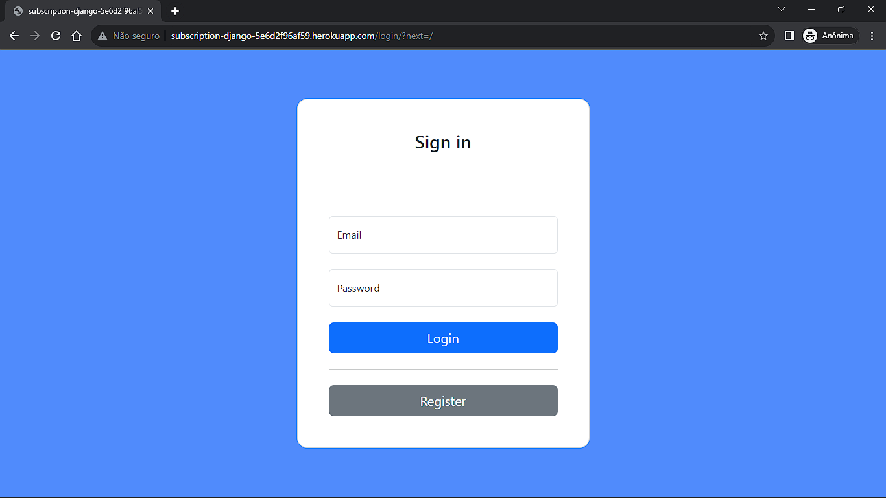
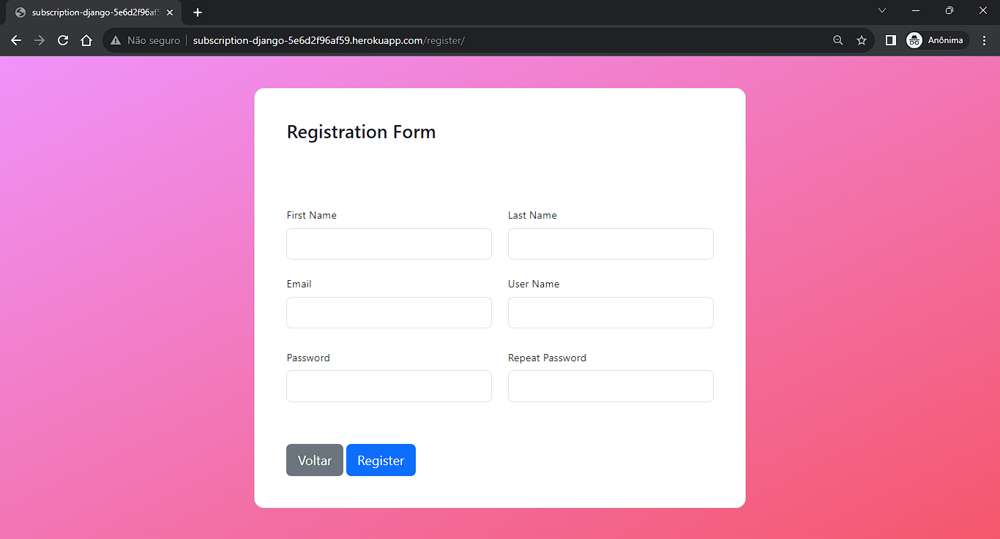
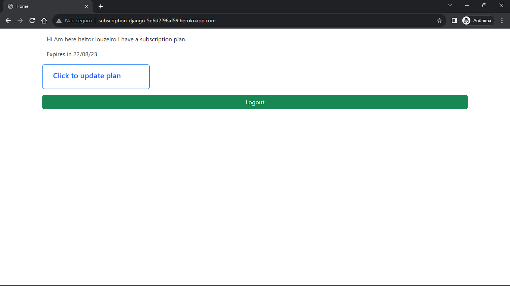
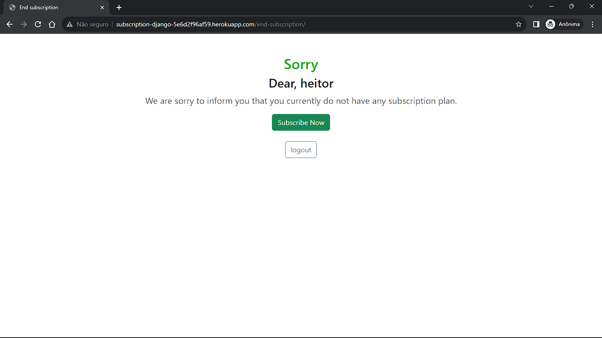
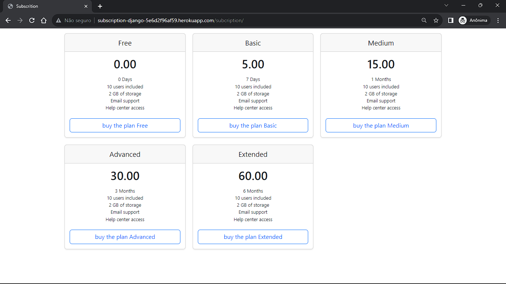

<!-- Improved compatibility of back to top link: See: https://github.com/othneildrew/Best-README-Template/pull/73 -->
<a name="top"></a>
<!--
*** Thanks for checking out the Best-README-Template. If you have a suggestion
*** that would make this better, please fork the repo and create a pull request
*** or simply open an issue with the tag "enhancement".
*** Don't forget to give the project a star!
*** Thanks again! Now go create something AMAZING! :D
-->


<!-- PROJECT SHIELDS -->
<!--
*** I'm using markdown "reference style" links for readability.
*** Reference links are enclosed in brackets [ ] instead of parentheses ( ).
*** See the bottom of this document for the declaration of the reference variables
*** for contributors-url, forks-url, etc. This is an optional, concise syntax you may use.
*** https://www.markdownguide.org/basic-syntax/#reference-style-links
-->
[![Contributors][contributors-shield]][contributors-url]
[![Forks][forks-shield]][forks-url]
[![Stargazers][stars-shield]][stars-url]
[![Issues][issues-shield]][issues-url]
[![MIT License][license-shield]][license-url]
[![LinkedIn][linkedin-shield]][linkedin-url]


<!-- PROJECT LOGO -->
<br/>
<h3 align="center">Django Subscripton</h3>

  <p align="center">
    <br/>
    <br />
    <a href="https://bit.ly/subscription-django">View Demo</a>
    ·
    <a href="https://github.com/HeitorLouzeiro/django-subscription/issues">Report Bug</a>
    ·
    <a href="https://github.com/HeitorLouzeiro/django-subscription/issues">Request Feature</a>
  </p>
</div>


<!-- TABLE OF CONTENTS -->
<details>
  <summary>Table of Contents</summary>
  <ol>
    <li>
      <a href="#about-the-project">About The Project</a>
      <ul>
        <li><a href="#built-with">Built With</a></li>
      </ul>
    </li>
    <li><a href="#usage">Usage</a></li>
    <li>
      <a href="#getting-started">Getting Started</a>
      <ul>
        <li><a href="#prerequisites">Prerequisites</a></li>
        <li><a href="#installation">Installation</a></li>
      </ul>
    </li>
    <li><a href="#roadmap">Roadmap</a></li>
    <li><a href="#contributing">Contributing</a></li>
    <li><a href="#collaborators">Collaborators</a></li>
    <li><a href="#license">License</a></li>
    <li><a href="#contact">Contact</a></li>
    <li><a href="#acknowledgments">Acknowledgments</a></li>
  </ol>
</details>


<!-- ABOUT THE PROJECT -->
## About The Project

This project is a signature system developed in Django, HTML, Bootstrap, JavaScript and CSS. It offers login functionalities, customer registration and registration of service plans, where it provides an easy-to-use registration platform for customers, management of new user registration, offers the option of subscribing to different service plans, where it has several validations in the forms with javascript.

* [Subcription-Django](https://bit.ly/subscription-django)

<p align="right">(<a href="#top">back to top</a>)</p>


### Built With

* [![Python][Python]][Python-url]
* [![Django][Django]][Django-url]
* [![JavaScript]][JavaScript-url]
* [![SQLite][SQLite]][SQLite]
* [![Bootstrap][Bootstrap.com]][Bootstrap-url]
* [![HTML][HTML]][HTML-url]
* [![CSS][CSS]][CSS-url]

<p align="right">(<a href="#top">back to top</a>)</p>

<!-- USAGE EXAMPLES -->
## Usage
### 1.User Login Page.
<p align="center">
      
    <br/>
</p>

### 2.Register Page.
<p align="center">
      
    <br/>
</p>

  ### 4.Home Page. 
<p align="center">
    
    <br/>
</p>

### 3.End Subscription Page.
<p align="center">
      
    <br/>
</p>

  ### 4.Subscription Page.
<p align="center">
    
    <br/>
</p>

<p align="right">(<a href="#top">back to top</a>)</p>

### Prerequisites

* [Python](https://www.python.org/)

<!-- GETTING STARTED -->
## Getting Started
### Installation

1. Clone the repo
   ```sh
   git clone https://github.com/HeitorLouzeiro/django-subscription.git
   ```
2. Access the project folder in terminal/cmd
   ```sh
   cd django-subscription
   ```
3. Create a virtualenv with Python 3.9.0.
   ```sh
   python -m venv venv
   ```
4. Activate virtualenv.
    * Ubunto
    ```sh
    source venv/bin/activate
    ```

    * MacOs
    ```sh
    source venv/bin/activate
    ```

    * Windows 
    ```sh
     venv\scripts\activate
    ```

5. Install as dependencies.
    ```sh
     pip install -r requirements.txt
    ```

6. Configure an instance with .env.
    ```sh
     cp .env-example .env
    ```
    or

    Copy the env-example to a new file called .env and then open it and change the variable values ​​if necessary
    
7. Run the migrations.
    ```sh
     python manage.py migrate
    ```
8. Run code create subcription
   ```sh
     python manage.py create_subscription
    ``` 

9.  Create a Superuser.
    ```sh
     python manage.py createsuperuser
    ``` 
    
10. Run the application.
    ```sh
     python manage.py runserver
    ```   

<p align="right">(<a href="#top">back to top</a>)</p>


<!-- ROADMAP -->
## Roadmap
  - [x] User Login Page.
  - [x] User Register Page.
  - [x] Home Page.
  - [x] Subscription Page.
  - [x] Subscription plan.
  - [x] End Subscription Page.
  - [x] Delete Subscription.


 


See the [open issues](https://github.com/HeitorLouzeiro/django-subscription/issues) for a full list of proposed features (and known issues).

<p align="right">(<a href="#top">back to top</a>)</p>

<!-- CONTRIBUTING -->
## Contributing

Contributions are what make the open source community such an amazing place to learn, inspire, and create. Any contributions you make are **greatly appreciated**.

If you have a suggestion that would make this better, please fork the repo and create a pull request. You can also simply open an issue with the tag "enhancement".
Don't forget to give the project a star! Thanks again!

1. Fork the Project
2. Create your Feature Branch (`git checkout -b feature/Improvements`)
3. Commit your Changes (`git commit -m 'Add my new Enhancements'`)
4. Push to the Branch (`git push origin feature/Improvements`)
5. Open a Pull Request

<p align="right">(<a href="#top">back to top</a>)</p>

## Collaborators

We thank the following people who contributed to this project:

<table>
  <tr>
    <td align="center">
      <a href="#">
        <br>
        <sub>
          <b>Heitor Louzeiro</b>
        </sub>
      </a>      
    </td>
  </tr>
</table>

<p align="right">(<a href="#top">back to top</a>)</p>


<!-- LICENSE -->
## License

Distributed under the MIT License. See [LICENSE](LICENSE) for more information.

<p align="right">(<a href="#top">back to top</a>)</p>


<!-- CONTACT -->
## Contact

<div align='center'>  
  <a href="https://www.instagram.com/heitorlouzeiro/" target="_blank">
    
  </a> 
  <a href = "mailto:heitorlouzeirodev@gmail.com">
        
  </a>
  <a href="https://www.linkedin.com/in/heitor-louzeiro/" target="_blank">
    
  </a> 
</div>

Project Link: [https://github.com/HeitorLouzeiro/django-subscription](https://github.com/HeitorLouzeiro/django-subscription)

<p align="right">(<a href="#top">back to top</a>)</p>


<!-- MARKDOWN LINKS & IMAGES -->
<!-- https://www.markdownguide.org/basic-syntax/#reference-style-links -->
[contributors-shield]: https://img.shields.io/github/contributors/HeitorLouzeiro/django-subscription.svg?style=for-the-badge
[contributors-url]: https://github.com/HeitorLouzeiro/django-subscription/graphs/contributors
[forks-shield]: https://img.shields.io/github/forks/HeitorLouzeiro/django-subscription.svg?style=for-the-badge
[forks-url]: https://github.com/HeitorLouzeiro/django-subscription/network/members
[stars-shield]: https://img.shields.io/github/stars/HeitorLouzeiro/django-subscription.svg?style=for-the-badge
[stars-url]: https://github.com/HeitorLouzeiro/django-subscription/stargazers
[issues-shield]: https://img.shields.io/github/issues/HeitorLouzeiro/django-subscription.svg?style=for-the-badge
[issues-url]: https://github.com/HeitorLouzeiro/django-subscription/issues
[license-shield]: https://img.shields.io/github/license/HeitorLouzeiro/django-subscription.svg?style=for-the-badge
[license-url]: https://github.com/HeitorLouzeiro/django-subscription/blob/master/LICENSE
[linkedin-shield]: https://img.shields.io/badge/-LinkedIn-black.svg?style=for-the-badge&logo=linkedin&colorB=555
[linkedin-url]: https://linkedin.com/in/heitor-louzeiro

[Python]: https://img.shields.io/badge/Python-14354C?style=for-the-badge&logo=python&logoColor=white
[Python-url]: https://www.python.org/

[Django]: https://img.shields.io/badge/Django-092E20?style=for-the-badge&logo=django&logoColor=white
[Django-url]: https://www.djangoproject.com/


[SQLite]: https://img.shields.io/badge/SQLite-07405E?style=for-the-badge&logo=sqlite&logoColor=white
[SQLite-url]: https://www.sqlite.org/index.html

[Bootstrap.com]: https://img.shields.io/badge/Bootstrap-563D7C?style=for-the-badge&logo=bootstrap&logoColor=white
[Bootstrap-url]: https://getbootstrap.com

[HTML]:https://img.shields.io/badge/HTML5-E34F26?style=for-the-badge&logo=html5&logoColor=white
[HTML-url]: https://github.com/HeitorLouzeiro/django-subscription/#

[CSS]: 	https://img.shields.io/badge/CSS-239120?&style=for-the-badge&logo=css3&logoColor=white
[CSS-url]: https://github.com/HeitorLouzeiro/django-subscription/#

[JavaScript]: https://img.shields.io/badge/JavaScript-F7DF1E?style=for-the-badge&logo=javascript&logoColor=black
[JavaScript-url]: https://github.com/HeitorLouzeiro/django-subscription/#


